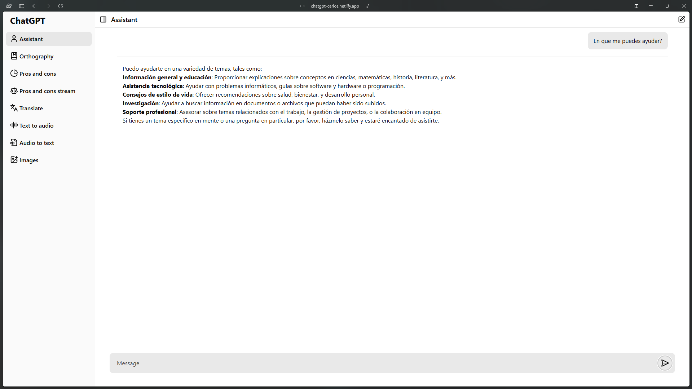

<h1>
    <em>Clon de ChatGPT</em>, minimalista con su backend hecho en NestJs
</h1>

Este proyecto es un clon de ChatGPT desarrollado con React que ofrece múltiples funcionalidades de inteligencia artificial. Permite mantener conversaciones con un asistente virtual, generar imágenes a partir de descripciones, convertir audio a texto y texto a audio con diferentes voces, y realizar traducciones a múltiples idiomas. El frontend está construido con React y se comunica con un backend personalizado desarrollado en NestJS, el cual gestiona todas las solicitudes y se integra con la API de OpenAI para proporcionar estas capacidades.

  </img>
  </img>
  </img>
  </img>

## 🛠️ Stack

- [**Astro**](https://es.react.dev/) - React (Vite).
- [**NestJS**](https://nestjs.com/) - NestJS con express.
- [**Typescript**](https://www.typescriptlang.org/) - JavaScript con sintaxis de tipado.
- [**OpenAI**](https://openai.com/) - API de openAI.
